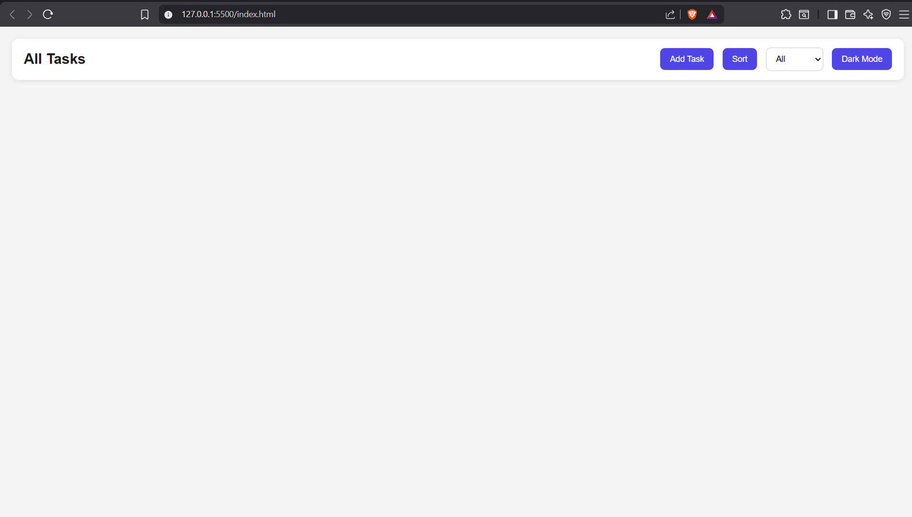
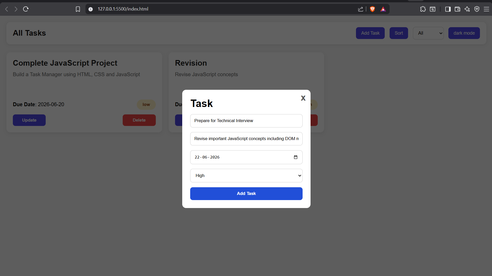
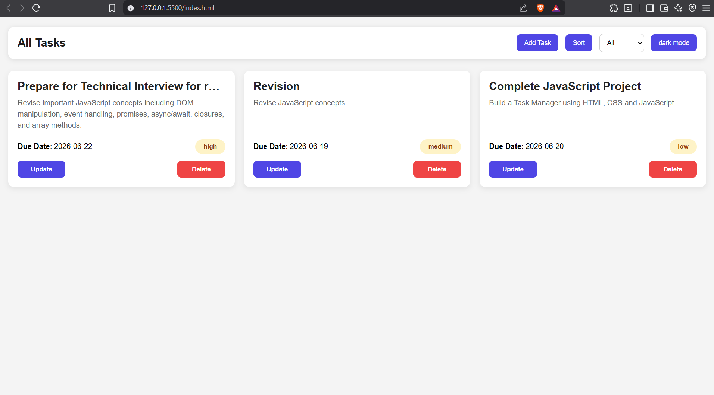
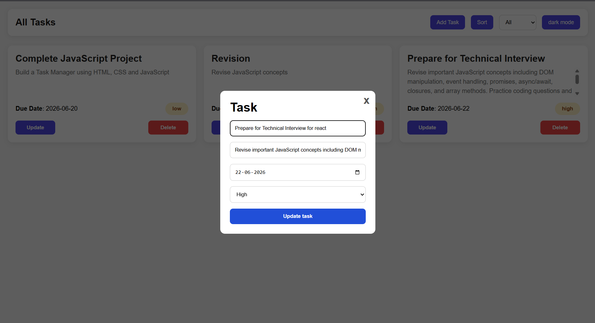

# Task Manager

A simple and responsive Task Manager application built using HTML, CSS, and JavaScript. This application helps users create, manage, and organize their daily tasks efficiently.

## 🚀 Features

* Add new tasks
* View all tasks in a clean interface
* Delete tasks
* Dynamic task rendering using JavaScript
* User-friendly interface

## 🛠️ Technologies Used

* HTML5
* CSS3
* JavaScript (ES6)


## 📸 Project Screenshots

### Home Page



### Add Task Form



### Task Sort List



### Update List




## ⚡ Getting Started

1. Clone the repository

```bash
git clone https://github.com/CodeWanderer25/taskManager.git
```

2. Navigate to the project folder

```bash
cd taskManager
```

3. Open `index.html` in your browser.

## 🎯 Future Improvements

* Local Storage support
* Search and filter tasks

## 👨‍💻 Author

**Priyanshu Goyal**

* GitHub: https://github.com/CodeWanderer25

## 📄 License

This project is open-source and available under the MIT License.
